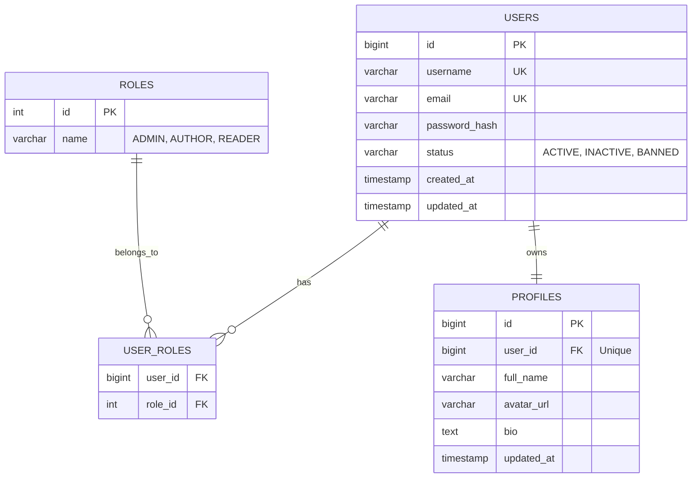
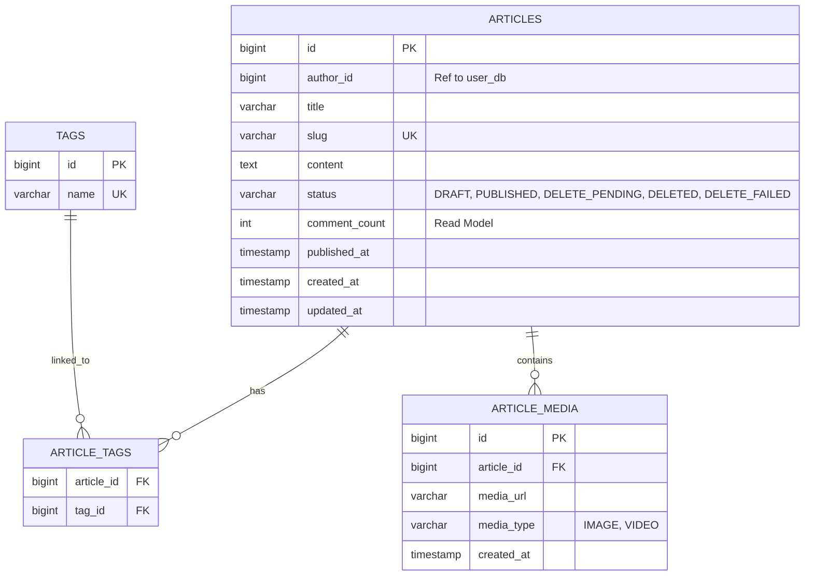
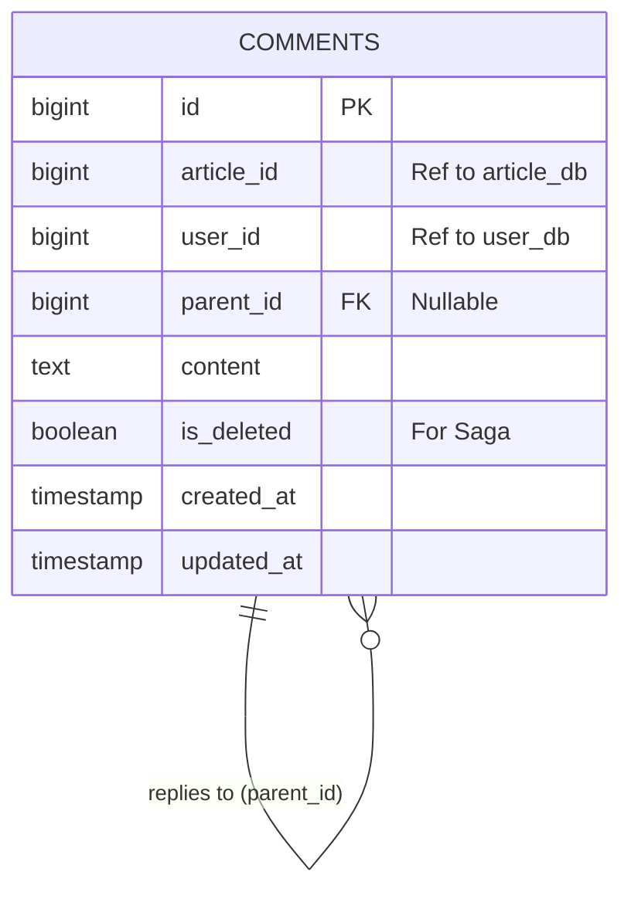
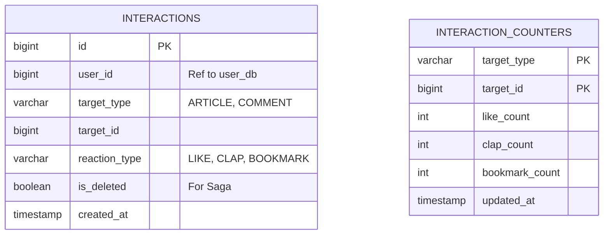
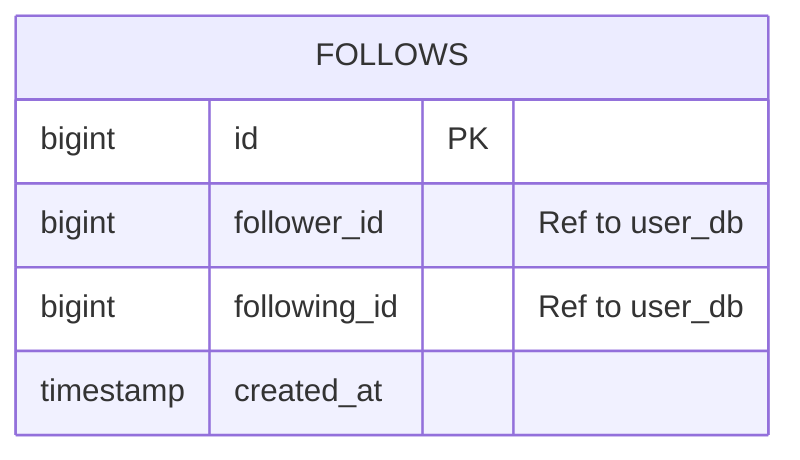
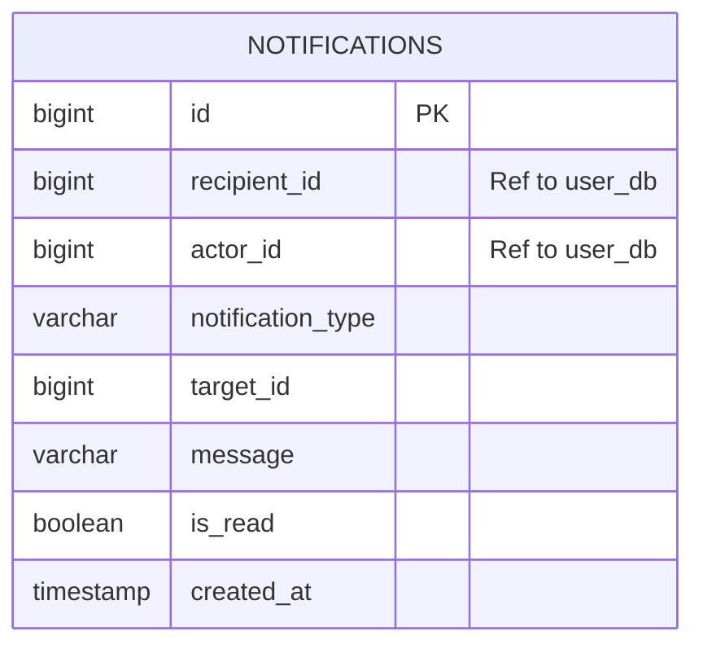

# Database Design - Social Media Platform (Medium-like)

This document contains the detailed database design for the Social Media Platform microservices architecture.

## 1. User Service Database (`user_db`)
**Responsibility:** Authentication, User Profiles, and Roles.

### ER Diagram


### SQL Scripts
```sql
CREATE TABLE users (
    id BIGSERIAL PRIMARY KEY,
    username VARCHAR(50) UNIQUE NOT NULL,
    email VARCHAR(100) UNIQUE NOT NULL,
    password_hash VARCHAR(255) NOT NULL,
    status VARCHAR(20) DEFAULT 'ACTIVE',
    created_at TIMESTAMP DEFAULT CURRENT_TIMESTAMP,
    updated_at TIMESTAMP DEFAULT CURRENT_TIMESTAMP
);

CREATE TABLE profiles (
    id BIGSERIAL PRIMARY KEY,
    user_id BIGINT UNIQUE NOT NULL,
    full_name VARCHAR(100),
    avatar_url VARCHAR(255),
    bio TEXT,
    updated_at TIMESTAMP DEFAULT CURRENT_TIMESTAMP
);

CREATE TABLE roles (
    id SERIAL PRIMARY KEY,
    name VARCHAR(20) UNIQUE NOT NULL
);

CREATE TABLE user_roles (
    user_id BIGINT REFERENCES users(id),
    role_id INT REFERENCES roles(id),
    PRIMARY KEY (user_id, role_id)
);
```

---

## 2. Article Service Database (`article_db`)
**Responsibility:** Article management, publishing flow, and Saga coordination.

### ER Diagram


### SQL Scripts
```sql
CREATE TABLE articles (
    id BIGSERIAL PRIMARY KEY,
    author_id BIGINT NOT NULL, -- Logical reference
    title VARCHAR(255) NOT NULL,
    slug VARCHAR(255) UNIQUE NOT NULL,
    content TEXT,
    status VARCHAR(20) DEFAULT 'DRAFT',
    comment_count INT DEFAULT 0,
    published_at TIMESTAMP,
    created_at TIMESTAMP DEFAULT CURRENT_TIMESTAMP,
    updated_at TIMESTAMP DEFAULT CURRENT_TIMESTAMP
);

CREATE TABLE tags (
    id BIGSERIAL PRIMARY KEY,
    name VARCHAR(50) UNIQUE NOT NULL
);

CREATE TABLE article_tags (
    article_id BIGINT REFERENCES articles(id),
    tag_id BIGINT REFERENCES tags(id),
    PRIMARY KEY (article_id, tag_id)
);

CREATE TABLE article_media (
    id BIGSERIAL PRIMARY KEY,
    article_id BIGINT REFERENCES articles(id),
    media_url VARCHAR(255) NOT NULL,
    media_type VARCHAR(20),
    created_at TIMESTAMP DEFAULT CURRENT_TIMESTAMP
);
```

---

## 3. Comment Service Database (`comment_db`)
**Responsibility:** Managing comments and replies with soft-delete support for Saga.

### ER Diagram


### SQL Scripts
```sql
CREATE TABLE comments (
    id BIGSERIAL PRIMARY KEY,
    article_id BIGINT NOT NULL,
    user_id BIGINT NOT NULL,
    parent_id BIGINT REFERENCES comments(id),
    content TEXT NOT NULL,
    is_deleted BOOLEAN DEFAULT FALSE,
    created_at TIMESTAMP DEFAULT CURRENT_TIMESTAMP,
    updated_at TIMESTAMP DEFAULT CURRENT_TIMESTAMP
);
```

---

## 4. Interaction Service Database (`interaction_db`)
**Responsibility:** Likes, Claps, and Bookmarks. Solves Race Conditions.

### ER Diagram


### SQL Scripts
```sql
CREATE TABLE interactions (
    id BIGSERIAL PRIMARY KEY,
    user_id BIGINT NOT NULL,
    target_type VARCHAR(20) NOT NULL,
    target_id BIGINT NOT NULL,
    reaction_type VARCHAR(20) NOT NULL,
    is_deleted BOOLEAN DEFAULT FALSE,
    created_at TIMESTAMP DEFAULT CURRENT_TIMESTAMP
);

-- Crucial Unique Index to prevent double likes (Race Condition)
CREATE UNIQUE INDEX idx_user_reaction ON interactions (user_id, target_type, target_id, reaction_type);

CREATE TABLE interaction_counters (
    target_type VARCHAR(20),
    target_id BIGINT,
    like_count INT DEFAULT 0,
    clap_count INT DEFAULT 0,
    bookmark_count INT DEFAULT 0,
    updated_at TIMESTAMP DEFAULT CURRENT_TIMESTAMP,
    PRIMARY KEY (target_type, target_id)
);
```

---

## 5. Follower Service Database (`follower_db`)
**Responsibility:** User following relationships.

### ER Diagram


### SQL Scripts
```sql
CREATE TABLE follows (
    id BIGSERIAL PRIMARY KEY,
    follower_id BIGINT NOT NULL,
    following_id BIGINT NOT NULL,
    created_at TIMESTAMP DEFAULT CURRENT_TIMESTAMP
);

CREATE UNIQUE INDEX idx_follower_following ON follows (follower_id, following_id);
```

---

## 6. Notification Service Database (`notification_db`)
**Responsibility:** Receiving events and storing alerts for users.

### ER Diagram


### SQL Scripts
```sql
CREATE TABLE notifications (
    id BIGSERIAL PRIMARY KEY,
    recipient_id BIGINT NOT NULL,
    actor_id BIGINT NOT NULL,
    notification_type VARCHAR(50),
    target_id BIGINT,
    message TEXT,
    is_read BOOLEAN DEFAULT FALSE,
    created_at TIMESTAMP DEFAULT CURRENT_TIMESTAMP
);
```
